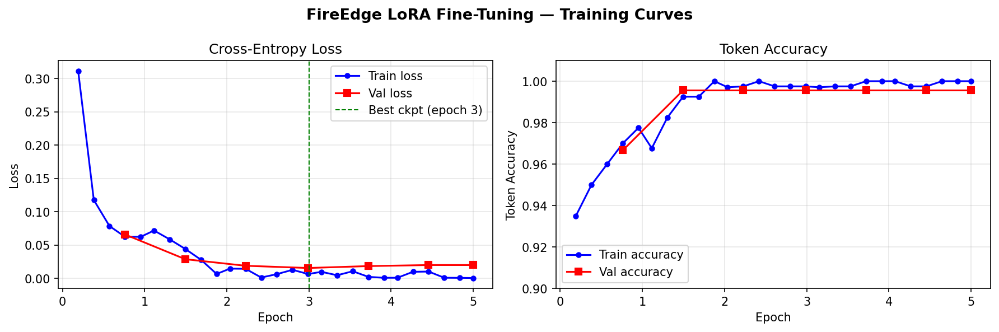
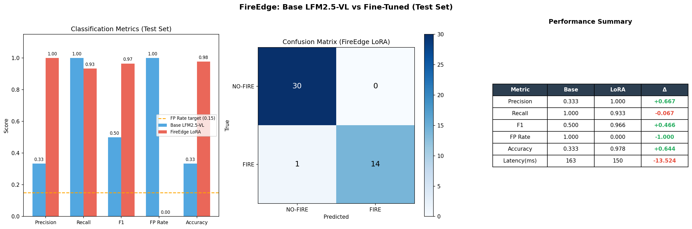

# FireEdge — モデル技術レポート

*LFM 2.5-VL-450M LoRA Fine-Tuning on Sentinel-2 SWIR Imagery*

---

## 1. 背景と課題

### 野火検知の現状

野火は毎年規模が拡大している。2023年カナダだけで史上最大の1,840万haが焼失した。初期検知の遅れが延焼の主因であり、既存手段にはそれぞれ根本的な限界がある。

| 手段 | 限界 |
|---|---|
| 地上目視 | 煙で視界ゼロ。広大な山林に人員が届かない |
| FIRMS / VIIRS | 解像度 375m。初期小規模火種を見逃す。地上処理後 9〜15時間の遅延 |
| GOES / Himawari | 解像度 ~2km。広域監視には有効だが精密位置特定不可 |
| Planet Labs 等 | RGB のみ。熱シグナルを持たず煙の下の火が見えない |

### このプロジェクトの位置づけ

当初は「衛星オンボードによるリアルタイム早期検知」をUVPとして設計した。しかし検証の結果、以下の制約が判明した。

- **Sentinel-2 のリビジット周期は 5〜10 日**。VIIRS は1日2〜4回通過し昼夜問わず熱赤外で検知できる。つまり Sentinel-2 が通過する時点で VIIRS はすでに検知済みであることが多く「早期検知」のUVPは成立しない
- Sentinel-2 は**受動光学センサーのため昼間（地方時 ~10:30）しか撮像できない**。夜間発生の火災は次回通過まで検出できない
- **雲は透過できない**。SWIR は煙を透過するが、雲があると画像が白飽和し火災シグナルが遮蔽される

したがって本プロジェクトの正確な位置づけは以下のとおりである。

> **「Sentinel-2 SWIR画像に対して LFM のLoRAファインチューニングが有効であることを実証する技術デモ」**

この実証（FTインフラ・学習データパイプライン・定量評価）は、焼跡マッピング・植生変化検知など他ユースケースへの転用基盤として機能する。

---

## 2. 技術アプローチ — なぜ SWIR × LFM か

### SWIR の物理的特性

Sentinel-2 の B11（1.61μm）・B12（2.19μm）バンドは**煙を透過する**。可視光（RGB）が煙で遮蔽される状況でも、SWIRでは活火・バーンスカー（焼跡）のシグナルが残る。ただし「煙透過」は主要差別化軸ではない。VIIRS（3.75μm 熱赤外）の方が煙透過性は高く夜間検知も可能。SWIRの価値は Sentinel-2 の **20m 高解像度**にある。

### なぜ閾値処理でなく VLM か

NBR2 等のスペクトル指標は PoC 段階で「シグナルが分離できるか」の確認に使った。本番の判定は VLM が行う。理由：

1. **文脈推論**: 農業焼畑・計画的野焼きと山火事が同じスペクトルシグナルを持つ場合、VLM は画像の幾何学的パターンや周囲の背景から文脈を読める可能性がある
2. **混合ピクセルへの対応**: 小規模火災は 20m ピクセル内に複数の土地被覆が混在し単純閾値では困難
3. **出力拡張性**: 重大度・延焼方向などの言語出力への拡張が将来可能

**注**: 本プロジェクトでは「FIRMS確認済み火災 vs 非火災」の2クラス分類のみを検証した。「農業焼畑 vs 山火事」の判別は未検証であり今後の課題。

---

## 3. 学習データ収集

### データソース

- **正例 (POS)**: NASA FIRMS VIIRS SNPP SP（アーカイブ）から取得した火災検知座標 → SimSat API で対応する Sentinel-2 SWIR シーンを取得
- **負例 NEG-temporal**: 同一座標の火災前（180 / 270 / 90 日前を順に確認）シーン
- **負例 NEG-diverse**: 全球ランダムグリッド（seed=42 固定）+ 手動追加の非火災シーン。意図的なバイオーム選択はせず汎化性を確保

### 収集パラメータ

| パラメータ | 値 |
|---|---|
| FIRMS 取得期間 | 2025-02-01 〜 2025-04-01（60日間、固定・再現可能） |
| 対象エリア | West/East Africa, SE Asia, Amazon, Australia, Central Africa, US West, Siberia |
| SimSat シーンサイズ | **5km × 5km**（`SIZE_KM=5.0`） |
| SimSat 検索ウィンドウ | ±12日（前後12日のうち最も新しい撮像シーンを返す） |
| FIRMS confidence フィルタ | `nominal` / `high`（SP略記: `n` / `h`）のみ採用 |
| POS タイムスタンプ | FIRMS 検知日時 **+2日**（burn scar が安定する期間） |
| Δ≥0 フィルタ | SimSat の撮像日時が FIRMS 検知日時以降であること |
| 雲量フィルタ | `cloud_cover ≤ 50%` |
| 黒画像フィルタ | 有効ピクセル比率 < 1%（全画素が 0 に近い）のシーンは除外 |

### NEG-temporal の選定ロジック

同一座標を 180日前 → 270日前 → 90日前 の順に確認し、最初に fire-free（FIRMS 照合でその時期に火災なし）かつ雲量・黒画像フィルタを通過した候補を採用する。全候補で通過しない場合はそのペアを破棄。

### データセット構成

| split | fire | no-fire | total |
|---|---|---|---|
| train | 70 | 140 | 210 |
| val | 15 | 30 | 45 |
| test | 15 | 30 | 45 |
| **計** | **100** | **200** | **300** |

no-fire 200件の内訳: NEG-temporal 100件 + NEG-diverse 100件  
分割はラベル比を保持した stratified split（seed=42）。

---

## 4. 前処理パイプライン

### SimSat → VLM 入力画像

VLMへの入力は **448×448 の PIL 画像 1枚のみ**。スペクトル指標の数値はVLMに渡さない。

```
SimSat API
  └── Sentinel-2 array (H×W×3) [SWIR22, SWIR16, NIR]  ← 3バンドのみ使用
          ↓ SpectralProcessor
  1. SWIR22・SWIR16 を共有スケールで percentile clip (2〜98パーセンタイル)
     ※ 共有スケールでバンド間比を保持。独立正規化するとバーンスカーの赤色が消える
  2. NIR は独立に percentile clip
  3. [SWIR22, SWIR16, NIR] → [R, G, B] チャネルとして uint8 変換
  4. Lanczos リサイズ → 448×448 PIL Image
     ※ SimSat が返す 5km シーンは約 502×505 px（~10m/px 相当）。
       LFM 2.5-VL の vision encoder が想定する 448px に合わせる微小ダウンスケール
          ↓
  LFM 2.5-VL-450M (LoRA fine-tuned)
```

疑似カラー合成により各土地被覆が視覚的に識別できる：

| 土地被覆 | SWIR22 (R) | SWIR16 (G) | NIR (B) | 色 |
|---|---|---|---|---|
| 活火 | 高輝度 | 中輝度 | 低輝度 | 明るい赤/オレンジ |
| バーンスカー | 中輝度 | 低輝度 | 低輝度 | 暗い赤/茶 |
| 健全植生 | 低輝度 | 低輝度 | 高輝度 | 青/緑 |
| 煙 | 中輝度 | 中輝度 | 中輝度 | 白/灰（全バンド均一散乱） |

### サンプル画像


上段: **FIRE シーン**（SE Asia、2025-03-25）。RGB では煙・植生が広がりfire の位置が判別困難。SWIR では活火が明るいオレンジとして浮き上がる。  
下段: **NO-FIRE シーン**（Danube delta Romania、健全植生）。SWIR では植生が青/緑系で火災シグナルなし。

---

## 5. VLM プロンプトと出力形式

### プロンプト

```
[system]
You are an expert satellite image analyst specializing in wildfire detection
using multispectral remote sensing data.
You are analyzing a false-color composite image where:
- RED channel = SWIR 2.2μm (B12): Active fire appears BRIGHT RED/ORANGE;
  burn scars appear DARK RED/BROWN
- GREEN channel = SWIR 1.6μm (B11): Thermal anomalies appear GREEN
- BLUE channel = NIR 842nm (B08): Healthy vegetation appears BLUE/GREEN
Respond ONLY with a valid JSON object. Do not include any explanation.

[user]
<image: 448×448 SWIR false-color composite>
Examine this satellite false-color composite image (R=SWIR2.2μm, G=SWIR1.6μm, B=NIR).
Does this scene contain active fire or burn scar?
Respond with JSON only: {"fire_detected": true} or {"fire_detected": false}
```

### 出力形式と例

```json
{"fire_detected": true}
```

```json
{"fire_detected": false}
```

学習・評価ともに assistant の出力はこの2種のみ。system・user トークンは損失計算から除外し（labels=-100）、assistant 応答トークンのみを学習対象とする（`VLMFireCollator` で実装）。

---

## 6. 学習設定

### LoRA 設定

| パラメータ | 値 |
|---|---|
| ベースモデル | `LiquidAI/LFM2.5-VL-450M` |
| LoRA rank r | 16 |
| LoRA alpha | 32 |
| dropout | 0.05 |
| 対象モジュール | q/k/v/out_proj（attention）、w1/w2/w3（FFN）、in_proj（conv projection）、linear_1/2（multimodal projector） |

### 学習ハイパーパラメータ

| パラメータ | 値 |
|---|---|
| epochs | 5 |
| learning rate | 2e-4（cosine decay、warmup 5%） |
| effective batch size | 8（per_device=1 × grad_accum=8） |
| dtype | bfloat16 |
| 損失対象 | assistant 応答トークンのみ（system・user を -100 でマスク） |
| hardware | NVIDIA RTX 5090（24GB VRAM）、Windows WSL2 |
| 学習時間 | **約 5 分**（135 steps） |

### 学習曲線



| epoch | train loss | val loss | val token accuracy |
|---|---|---|---|
| 0.76 | 0.062 | 0.066 | 96.7% |
| 1.50 | 0.044 | **0.029** | 99.6% |
| 2.99 | 0.007 | **0.016** ← best | 99.6% |
| 3.72 | 0.002 | 0.019 | 99.6% |
| 5.00 | 0.001 | 0.020 | 99.6% |

epoch 3 前後で val loss が最小（best checkpoint = step 80）。epoch 4〜5 で微小な過学習が見られるが test set 精度への影響は軽微。

---

## 7. 評価結果

### Test set（n=45、held-out、学習中未使用）



| メトリクス | Base LFM2.5-VL | FireEdge LoRA | Δ |
|---|---|---|---|
| Precision | 0.333 | **1.000** | +0.667 |
| Recall | 1.000 | **0.933** | −0.067 |
| F1 | 0.500 | **0.966** | +0.466 |
| **FP Rate** | **1.000** | **0.000** | **−1.000** |
| Accuracy | 0.333 | **0.978** | +0.644 |
| 推論レイテンシ（平均） | 163 ms | 150 ms | −14 ms |

Confusion matrix（LoRA）: TN=30 / FP=0 / FN=1 / TP=14

**ベースモデルの挙動**: 全45件を「火災あり」と判定（FP Rate=1.0）。ドメイン固有の SWIR 疑似カラー画像に対してベースモデルは使い物にならない。

**LoRAファインチューニングの効果**: 誤報ゼロ（FP=0）、見逃し1件（FN=1）。目標 Recall≥0.85・FP Rate≤0.15 を達成。

### 目標達成チェック

- ✅ Recall 0.933（目標 ≥ 0.85）
- ✅ FP Rate 0.000（目標 ≤ 0.15）
- ✅ Alert JSON < 900 bytes（目標 < 2,048 bytes）
- ✅ 推論レイテンシ ~150 ms
- ✅ VRAM ~900 MB（目標 < 1GB）

---

## 8. 推論時の制約とユーザーへの通知

| 制約 | 条件 | 挙動 |
|---|---|---|
| **雲による遮蔽** | `cloud_cover > 50%` | 検知不可。`warning` フィールドに明示 |
| **黒画像** | 有効ピクセル比率 < 1% | 推論を実行しない。`image_available=false` を返す |
| **昼間のみ** | 夜間は撮像なし | 夜間発生の火災は次回通過（5〜10日後）まで検出不可 |
| **混合ピクセル** | 小規模火災（FRP < 20MW 程度） | 20m ピクセル内でシグナルが希釈され検知困難 |
| **野焼き・焼畑** | 計画的焼却 | 学習データに未含有。誤検知の可能性あり |

```json
{
  "fire_detected": false,
  "scene": { "cloud_pct": 87.3 },
  "warning": "cloud_cover exceeds 50% — detection unreliable"
}
```

---

## 9. 再現手順

```bash
cd apps/fireedge

# 1. データ収集（SimSat + NASA FIRMS、約60分）
uv run python -m finetune.dataset_builder

# 2. 学習（RTX 5090 で約5分）
uv run python -m finetune.train

# 3. 評価（base model 比較あり）
uv run python -m finetune.evaluate --run-base

# 4. E2Eデモ（SimSat 起動必須）→ 出力例は README.md 参照
uv run python demo.py
```
